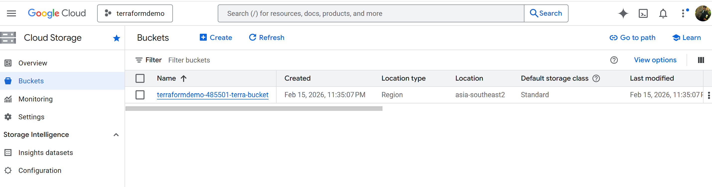

# Install Terraform in the Github Codespaces Container

Install Terraform in the Dev Container
Update the package list:
sudo apt update

Install the HashiCorp GPG key:
curl -fsSL https://apt.releases.hashicorp.com/gpg | sudo gpg --dearmor -o /usr/share/keyrings/hashicorp-archive-keyring.gpg

Add the HashiCorp repository:
echo "deb [signed-by=/usr/share/keyrings/hashicorp-archive-keyring.gpg] https://apt.releases.hashicorp.com $(lsb_release -cs) main" | sudo tee /etc/apt/sources.list.d/hashicorp.list

Update the package list again:
sudo apt update

Install Terraform:
sudo apt install terraform

Verify the installation:
terraform version

Once installed, you can run terraform fmt to format your Terraform files.


# Terraform GCP Storage Bucket

## Reference Documentation : 
https://registry.terraform.io/providers/hashicorp/google/4.72.1/docs/resources/storage_bucket

## Overview
Provision a GCP Storage Bucket using Terraform.

## Project Details
| Item | Value |
|------|-------|
| **Project ID** | terraformdemo-485501 |
| **Bucket Name** | terraformdemo-485501-terra-bucket |
| **Service Account** | terraform-runner |

### Required Permissions
- Big Query Admin
- Compute Admin
- Storage Admin

## Prerequisites
- Terraform 0.13+
- GCP credentials configured (`keys/mycreds.json`)

## Terraform Configuration

### Provider Setup
```hcl
terraform {
  required_providers {
    google = {
      source  = "hashicorp/google"
      version = "7.16.0"
    }
  }
}

provider "google" {
  credentials = "./keys/mycreds.json"
  project     = "terraformdemo-485501"
  region      = "asia-southeast1"
}
```

## Commands

### Format
```bash
terraform fmt
```

### Initialize
```bash
terraform init
```

.terraform.lock.hcl file will be created in the path /terraform-workshop
.terraform folder will be created in the path /terraform-workshop

### Plan
```bash
terraform plan
```

 + create

Terraform will perform the following actions:

  # google_bigquery_dataset.demo_dataset will be created
  + resource "google_bigquery_dataset" "demo_dataset" {
      + creation_time              = (known after apply)
      + dataset_id                 = "demo_dataset"
      + default_collation          = (known after apply)
      + delete_contents_on_destroy = false
      + effective_labels           = {
          + "goog-terraform-provisioned" = "true"
        }
      + etag                       = (known after apply)
      + id                         = (known after apply)
      + is_case_insensitive        = (known after apply)
      + last_modified_time         = (known after apply)
      + location                   = "ASIA-SOUTHEAST2"
      + max_time_travel_hours      = (known after apply)
      + project                    = "terraformdemo-485501"
      + self_link                  = (known after apply)
      + storage_billing_model      = (known after apply)
      + terraform_labels           = {
          + "goog-terraform-provisioned" = "true"
        }

      + access (known after apply)
    }

  # google_storage_bucket.demo-bucket will be created
  + resource "google_storage_bucket" "demo-bucket" {
      + effective_labels            = {
          + "goog-terraform-provisioned" = "true"
        }
      + force_destroy               = true
      + id                          = (known after apply)
      + location                    = "ASIA-SOUTHEAST2"
      + name                        = "terraformdemo-485501-terra-bucket"
      + project                     = (known after apply)
      + project_number              = (known after apply)
      + public_access_prevention    = (known after apply)
      + rpo                         = (known after apply)
      + self_link                   = (known after apply)
      + storage_class               = "STANDARD"
      + terraform_labels            = {
          + "goog-terraform-provisioned" = "true"
        }
      + time_created                = (known after apply)
      + uniform_bucket_level_access = (known after apply)
      + updated                     = (known after apply)
      + url                         = (known after apply)

      + lifecycle_rule {
          + action {
              + type          = "AbortIncompleteMultipartUpload"
                # (1 unchanged attribute hidden)
            }
          + condition {
              + age                    = 1
              + matches_prefix         = []
              + matches_storage_class  = []
              + matches_suffix         = []
              + with_state             = (known after apply)
                # (3 unchanged attributes hidden)
            }
        }

      + soft_delete_policy (known after apply)

      + versioning (known after apply)

      + website (known after apply)
    }

Plan: 2 to add, 0 to change, 0 to destroy.

────────────────────────────────────────────────────────────────────────────────────

Note: You didn't use the -out option to save this plan, so Terraform can't guarantee
to take exactly these actions if you run "terraform apply" now.


### Apply
```bash
terraform apply
```

Terraform used the selected providers to generate the following execution plan.
Resource actions are indicated with the following symbols:
  + create

Terraform will perform the following actions:

  # google_bigquery_dataset.demo_dataset will be created
  + resource "google_bigquery_dataset" "demo_dataset" {
      + creation_time              = (known after apply)
      + dataset_id                 = "demo_dataset"
      + default_collation          = (known after apply)
      + delete_contents_on_destroy = false
      + effective_labels           = {
          + "goog-terraform-provisioned" = "true"
        }
      + etag                       = (known after apply)
      + id                         = (known after apply)
      + is_case_insensitive        = (known after apply)
      + last_modified_time         = (known after apply)
      + location                   = "ASIA-SOUTHEAST2"
      + max_time_travel_hours      = (known after apply)
      + project                    = "terraformdemo-485501"
      + self_link                  = (known after apply)
      + storage_billing_model      = (known after apply)
      + terraform_labels           = {
          + "goog-terraform-provisioned" = "true"
        }

      + access (known after apply)
    }

  # google_storage_bucket.demo-bucket will be created
  + resource "google_storage_bucket" "demo-bucket" {
      + effective_labels            = {
          + "goog-terraform-provisioned" = "true"
        }
      + force_destroy               = true
      + id                          = (known after apply)
      + location                    = "ASIA-SOUTHEAST2"
      + name                        = "terraformdemo-485501-terra-bucket"
      + project                     = (known after apply)
      + project_number              = (known after apply)
      + public_access_prevention    = (known after apply)
      + rpo                         = (known after apply)
      + self_link                   = (known after apply)
      + storage_class               = "STANDARD"
      + terraform_labels            = {
          + "goog-terraform-provisioned" = "true"
        }
      + time_created                = (known after apply)
      + uniform_bucket_level_access = (known after apply)
      + updated                     = (known after apply)
      + url                         = (known after apply)

      + lifecycle_rule {
          + action {
              + type          = "AbortIncompleteMultipartUpload"
                # (1 unchanged attribute hidden)
            }
          + condition {
              + age                    = 1
              + matches_prefix         = []
              + matches_storage_class  = []
              + matches_suffix         = []
              + with_state             = (known after apply)
                # (3 unchanged attributes hidden)
            }
        }

      + soft_delete_policy (known after apply)

      + versioning (known after apply)

      + website (known after apply)
    }

Plan: 2 to add, 0 to change, 0 to destroy.

Do you want to perform these actions?
  Terraform will perform the actions described above.
  Only 'yes' will be accepted to approve.

  Enter a value: yes

google_bigquery_dataset.demo_dataset: Creating...
google_storage_bucket.demo-bucket: Creating...
google_bigquery_dataset.demo_dataset: Creation complete after 2s [id=projects/terraformdemo-485501/datasets/demo_dataset]
google_storage_bucket.demo-bucket: Creation complete after 3s [id=terraformdemo-485501-terra-bucket]

Apply complete! Resources: 2 added, 0 changed, 0 destroyed.



### Destroy
```bash
terraform destroy
```

google_storage_bucket.demo-bucket: Refreshing state... [id=terraformdemo-485501-terra-bucket]
google_bigquery_dataset.demo_dataset: Refreshing state... [id=projects/terraformdemo-485501/datasets/demo_dataset]

Terraform used the selected providers to generate the following execution plan.
Resource actions are indicated with the following symbols:
  - destroy

Terraform will perform the following actions:

  # google_bigquery_dataset.demo_dataset will be destroyed
  - resource "google_bigquery_dataset" "demo_dataset" {
      - creation_time                   = 1771158906519 -> null
      - dataset_id                      = "demo_dataset" -> null
      - default_partition_expiration_ms = 0 -> null
      - default_table_expiration_ms     = 0 -> null
      - delete_contents_on_destroy      = false -> null
      - effective_labels                = {
          - "goog-terraform-provisioned" = "true"
        } -> null
      - etag                            = "tj38MJ1YK1N/+YTzrUzVNA==" -> null
      - id                              = "projects/terraformdemo-485501/datasets/demo_dataset" -> null
      - is_case_insensitive             = false -> null
      - labels                          = {} -> null
      - last_modified_time              = 1771158906519 -> null
      - location                        = "asia-southeast2" -> null
      - max_time_travel_hours           = "168" -> null
      - project                         = "terraformdemo-485501" -> null
      - resource_tags                   = {} -> null
      - self_link                       = "https://bigquery.googleapis.com/bigquery/v2/projects/terraformdemo-485501/datasets/demo_dataset" -> null
      - terraform_labels                = {
          - "goog-terraform-provisioned" = "true"
        } -> null
        # (4 unchanged attributes hidden)

      - access {
          - role           = "OWNER" -> null
          - user_by_email  = "terraform-runner@terraformdemo-485501.iam.gserviceaccount.com" -> null
            # (4 unchanged attributes hidden)
        }
      - access {
          - role           = "OWNER" -> null
          - special_group  = "projectOwners" -> null
            # (4 unchanged attributes hidden)
        }
      - access {
          - role           = "READER" -> null
          - special_group  = "projectReaders" -> null
            # (4 unchanged attributes hidden)
        }
      - access {
          - role           = "WRITER" -> null
          - special_group  = "projectWriters" -> null
            # (4 unchanged attributes hidden)
        }
    }

  # google_storage_bucket.demo-bucket will be destroyed
  - resource "google_storage_bucket" "demo-bucket" {
      - default_event_based_hold    = false -> null
      - effective_labels            = {
          - "goog-terraform-provisioned" = "true"
        } -> null
      - enable_object_retention     = false -> null
      - force_destroy               = true -> null
      - id                          = "terraformdemo-485501-terra-bucket" -> null
      - labels                      = {} -> null
      - location                    = "ASIA-SOUTHEAST2" -> null
      - name                        = "terraformdemo-485501-terra-bucket" -> null
      - project                     = "terraformdemo-485501" -> null
      - project_number              = 354863628678 -> null
      - public_access_prevention    = "inherited" -> null
      - requester_pays              = false -> null
      - self_link                   = "https://www.googleapis.com/storage/v1/b/terraformdemo-485501-terra-bucket" -> null
      - storage_class               = "STANDARD" -> null
      - terraform_labels            = {
          - "goog-terraform-provisioned" = "true"
        } -> null
      - time_created                = "2026-02-15T12:35:07.661Z" -> null
      - uniform_bucket_level_access = false -> null
      - updated                     = "2026-02-15T12:35:07.661Z" -> null
      - url                         = "gs://terraformdemo-485501-terra-bucket" -> null

      - hierarchical_namespace {
          - enabled = false -> null
        }

      - lifecycle_rule {
          - action {
              - type          = "AbortIncompleteMultipartUpload" -> null
                # (1 unchanged attribute hidden)
            }
          - condition {
              - age                                     = 1 -> null
              - days_since_custom_time                  = 0 -> null
              - days_since_noncurrent_time              = 0 -> null
              - matches_prefix                          = [] -> null
              - matches_storage_class                   = [] -> null
              - matches_suffix                          = [] -> null
              - num_newer_versions                      = 0 -> null
              - send_age_if_zero                        = false -> null
              - send_days_since_custom_time_if_zero     = false -> null
              - send_days_since_noncurrent_time_if_zero = false -> null
              - send_num_newer_versions_if_zero         = false -> null
              - with_state                              = "ANY" -> null
                # (3 unchanged attributes hidden)
            }
        }

      - soft_delete_policy {
          - effective_time             = "2026-02-15T12:35:07.661Z" -> null
          - retention_duration_seconds = 604800 -> null
        }
    }

Plan: 0 to add, 0 to change, 2 to destroy.

Do you really want to destroy all resources?
  Terraform will destroy all your managed infrastructure, as shown above.
  There is no undo. Only 'yes' will be accepted to confirm.

  Enter a value: yes

google_storage_bucket.demo-bucket: Destroying... [id=terraformdemo-485501-terra-bucket]
google_bigquery_dataset.demo_dataset: Destroying... [id=projects/terraformdemo-485501/datasets/demo_dataset]
google_bigquery_dataset.demo_dataset: Destruction complete after 1s
google_storage_bucket.demo-bucket: Destruction complete after 2s

Destroy complete! Resources: 2 destroyed.


## Resources
- [Terraform Google Provider Documentation](https://registry.terraform.io/providers/hashicorp/google/latest/docs)
- [Google Storage Bucket Resource](https://registry.terraform.io/providers/hashicorp/google/latest/docs/resources/storage_bucket)
- [Big Query Dataset](http://registry.terraform.io/providers/hashicorp/google/6.3.0/docs/resources/bigquery_dataset)