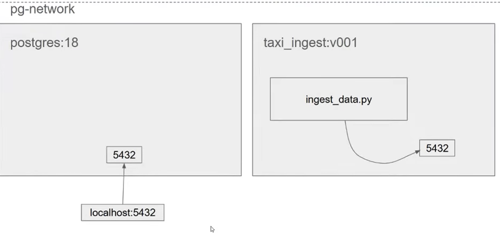
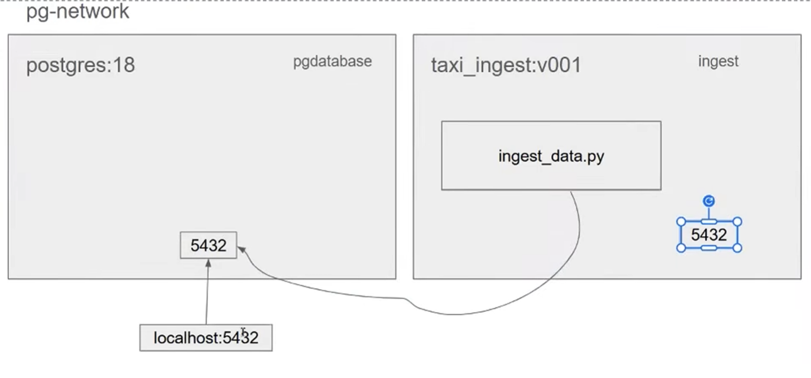
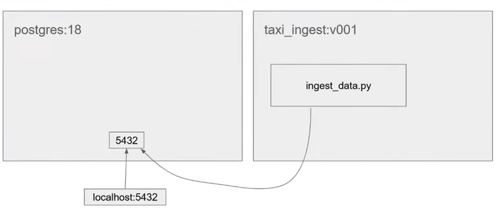
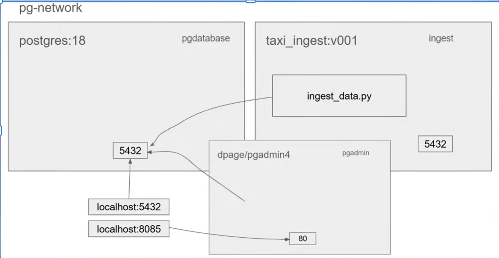

Setting up a python data pipeline using Docker Image / Container 

NYC Taxi Reference Dataset : 
https://www.nyc.gov/site/tlc/about/tlc-trip-record-data.page
https://github.com/DataTalksClub/nyc-tlc-data/releases/tag/yellow 
For download : https://github.com/DataTalksClub/nyc-tlc-data/releases/download/yellow

Docker Postgres Command Sheet

Docker, run a Postgres version 18 database. Call the database ny_taxi, set the login to root/root, make sure the data is saved permanently in a volume, and let me access it through port 5432. Oh, and clean up the container when I'm done with it

1.docker run -it --rm \
  -e POSTGRES_USER="root" \
  -e POSTGRES_PASSWORD="root" \
  -e POSTGRES_DB="ny_taxi" \
  -v ny_taxi_postgres_data:/var/lib/postgresql \
  -p 5432:5432 \
  postgres:18
-e represents the environment variables to be set before running a postgres session
The container here is postgres:18
-v represents the volume mapping , we can preserve our data and anything put here will remain here when opened again
Normally, if a container is deleted, all its data is gone forever.
This creates a Volume (a permanent folder on your Codespace host). It "plugs" that folder into the container's database storage path. Now, even if you stop and delete the container, your data stays safe in that volume
The actual folder on the Codespaces host machine is typically: /var/lib/docker/volumes/ny_taxi_postgres_data/_data

Note: You usually cannot cd into this folder directly. Because it’s in /var/lib/docker, it is owned by the root user. To see the files inside, you would need to use sudo

Docker CLI:

Bash
docker volume inspect ny_taxi_postgres_data
This will return a JSON block. Look for the "Mountpoint" key—that is the exact path where your database data is physically stored on the disk.

(pipeline) @deepaknrn ➜ /var/lib $ docker volume inspect ny_taxi_postgres_data
[
    {
        "CreatedAt": "2026-01-17T14:32:44Z",
        "Driver": "local",
        "Labels": null,
        "Mountpoint": "/var/lib/docker/volumes/ny_taxi_postgres_data/_data",
        "Name": "ny_taxi_postgres_data",
        "Options": null,
        "Scope": "local"
    }
]

-p represents port number 5432 
Left side (5432): The port on your Codespace/Host.
Right side (5432): The port inside the Docker container.
This "opens a door." It allows tools running in your Codespace (like a Python script or a DB tool) to talk to the Postgres database inside the container

5432 is the port in the docker container where the postgres application is running and waiting for incoming requests
5432 is also the port in the host machine (here GitHub codespaces)
We have port 5432 in the host machine (here GitHub codespaces) that is mapped to 5432 is the docker container 
port mapping is done here , similar to volume mapping done using -v
when we send a request to localhost:5432 (GitHub codespaces) we ideally send the request to whatever is running inside the docker container (5432)

This will start the postgres instance and will be running

PostgreSQL Database directory appears to contain a database; Skipping initialization

2026-02-04 12:39:42.848 UTC [1] LOG:  starting PostgreSQL 18.1 (Debian 18.1-1.pgdg13+2) on x86_64-pc-linux-gnu, compiled by gcc (Debian 14.2.0-19) 14.2.0, 64-bit
2026-02-04 12:39:42.849 UTC [1] LOG:  listening on IPv4 address "0.0.0.0", port 5432
2026-02-04 12:39:42.849 UTC [1] LOG:  listening on IPv6 address "::", port 5432
2026-02-04 12:39:42.852 UTC [1] LOG:  listening on Unix socket "/var/run/postgresql/.s.PGSQL.5432"
2026-02-04 12:39:42.860 UTC [31] LOG:  database system was shut down at 2026-02-02 23:20:39 UTC
2026-02-04 12:39:42.961 UTC [1] LOG:  database system is ready to accept connections
2026-02-04 12:39:46.308 UTC [35] LOG:  invalid length of startup packet
2026-02-04 12:39:47.421 UTC [36] LOG:  invalid length of startup packet
2026-02-04 12:39:47.467 UTC [37] LOG:  invalid length of startup packet
2026-02-04 12:39:47.510 UTC [38] LOG:  invalid length of startup packet
2026-02-04 12:39:52.612 UTC [39] LOG:  invalid length of startup packet

Verify if the container is running using docker ps -a 

CONTAINER ID   IMAGE         COMMAND                  CREATED         STATUS         PORTS                                         NAMES
b169ca5794a1   postgres:18   "docker-entrypoint.s…"   2 minutes ago   Up 2 minutes   0.0.0.0:5432->5432/tcp, [::]:5432->5432/tcp   pg-database

URL : http://127.0.0.1:5433/

2.To access postgres cli , install pgcli using uv command , If already installed go to Step#3
uv add --dev pgcli

3.Open a new terminal window(bash)
uv run pgcli -h localhost -p 5432  -u root -d ny_taxi
It connects to localhost:5432 which inturn forwards to postgresql docker container running in port 5432
You will now be able to access the postgresql18 ny_taxi database via the CLI

To Containerize the Python code [ingest_data.py] and execute it within a docker container
4.Build the docker image after the Dockerfile has been created
docker build -t taxi_ingest:v001 .
taxi_ingest=docker image, v001=tag together is the docker image
=> [internal] load build definition from Dockerfile                            0.1s
 => => transferring dockerfile: 1.92kB                                          0.0s
 => [internal] load metadata for docker.io/library/python:3.13.11-slim          0.0s
 => [internal] load metadata for ghcr.io/astral-sh/uv:latest                    1.2s
 => [auth] astral-sh/uv:pull token for ghcr.io                                  0.0s
 => [internal] load .dockerignore                                               0.0s
 => => transferring context: 2B                                                 0.0s
 => FROM ghcr.io/astral-sh/uv:latest@sha256:db9370c2b0b837c74f454bea914343da9f  0.0s
 => [internal] load build context                                               0.0s
 => => transferring context: 132B                                               0.0s
 => [stage-0 1/7] FROM docker.io/library/python:3.13.11-slim                    0.0s
 => CACHED [stage-0 2/7] COPY --from=ghcr.io/astral-sh/uv:latest /uv /bin/      0.0s
 => CACHED [stage-0 3/7] WORKDIR /code                                          0.0s
 => [stage-0 4/7] COPY pyproject.toml .python-version uv.lock ./                0.2s
 => [stage-0 5/7] RUN uv sync --locked                                         13.0s
 => [stage-0 6/7] WORKDIR /code                                                 0.0s
 => [stage-0 7/7] COPY ingest_data.py .                                         0.1s
 => exporting to image                                                         11.1s
 => => exporting layers                                                        11.0s
 => => writing image sha256:e4f9cfe4a12094be4931a57c31a092c8f5eca1495ed964aa5c  0.0s
 => => naming to docker.io/library/taxi_ingest:v001                             0.0s

5.Running the ingestion script from a dockerized container to insert data in the postgres container target table 
docker run -it --rm taxi_ingest:v001 --year 2021 --month 1 --pg-user root --pg-password root --pg-host localhost --pg-port 5432 --pg-db ny_taxi --target-table yellow_taxi_data --chunksize 100000
Error :
connect
    conn = _connect(dsn, connection_factory=connection_factory, **kwasync)
sqlalchemy.exc.OperationalError: (psycopg2.OperationalError) connection to server at "localhost" (::1), port 5432 failed: Connection refused
        Is the server running on that host and accepting TCP/IP connections?
connection to server at "localhost" (127.0.0.1), port 5432 failed: Connection refused
        Is the server running on that host and accepting TCP/IP connections?

(Background on this error at: https://sqlalche.me/e/20/e3q8)

6.Now run both the containers in the same network 

Assign a name to each container 
pgdatabase is the name assigned to postgres:18 container
ingest is the name assigned to taxi_ingest:v001 container

In One terminal window run this 
docker run -it --rm \
  -e POSTGRES_USER="root" \
  -e POSTGRES_PASSWORD="root" \
  -e POSTGRES_DB="ny_taxi" \
  -v ny_taxi_postgres_data:/var/lib/postgresql \
  -p 5432:5432 \
  --network=pg-network \
  --name pg-database \
  postgres:18

In Another terminal window run this [This will execute the ingest_data.py within a docker container and that will connect to the postgres:18 container to insert the data into the table ]
docker run -it --rm \
    --network=pg-network \
    taxi_ingest:v001 \
    --year 2021 \
    --month 1 \
    --pg-user root \
    --pg-password root \
    --pg-host pg-database \
    --pg-port 5432 \
    --pg-db ny_taxi \
    --target-table yellow_taxi_data

7.To view front end UI(pgadmin) to validate the data
docker run -it --rm \
  -e PGADMIN_DEFAULT_EMAIL="admin@admin.com" \
  -e PGADMIN_DEFAULT_PASSWORD="root" \
  -v pgadmin_data:/var/lib/pgadmin \
  -p 8085:80 \
  --network=pg-network \
  --name pgadmin \
  dpage/pgadmin4

Jupyter Lab Command Sheet 
1. Install Jupyter lab as a dev dependency : 
uv add --dev jupyter

2. Run jupyter lab 
uv run jupyter notebook
While postgres container runs on localhost:5432 : 5432 mapping , jupyterlab runs on port number 8888 in the local machine 
http://127.0.0.1:8888/tree?

3. Convert a Jupyter lab notebook to a python script [.ipynb to .py]
uv run jupyter nbconvert --to=script notebook.ipynb
[NbConvertApp] Converting notebook notebook.ipynb to script
[NbConvertApp] Writing 3293 bytes to notebook.py

Execute ingest_data.py Script
This Script will ingest the data from the NYC taxi data to the postgre:18 docker/container yellow_taxi_data table within the public schema
| Schema | Name             | Type  | Owner |
|--------+------------------+-------+-------|
| public | yellow_taxi_data | table | root  |

1.uv run python ingest_data.py --help
[To view the list of click cli paramters before executing the code]

2.Running the ingestion script from local machine(GitHub codespaces)to insert data in the postgres container target table
uv run python ingest_data.py \
   --pg-user=root \
   --pg-password=root \
   --pg-host=localhost \
   --pg-port=5432 \
   --pg-db=ny_taxi \
   --target-table=yellow_taxi_data \
   --year=2021 \
   --month=1 \
   --chunksize=100000

3.Running the ingestion script from a dockerized container to insert data in the postgres container target table 
docker run -it --rm taxi_ingest:v001 --year 2021 --month 1 --pg-user root --pg-password root --pg-host localhost --pg-port 5432 --pg-db ny_taxi --target-table yellow_taxi_data --chunksize 100000
Error :
connect
    conn = _connect(dsn, connection_factory=connection_factory, **kwasync)
sqlalchemy.exc.OperationalError: (psycopg2.OperationalError) connection to server at "localhost" (::1), port 5432 failed: Connection refused
        Is the server running on that host and accepting TCP/IP connections?
connection to server at "localhost" (127.0.0.1), port 5432 failed: Connection refused
        Is the server running on that host and accepting TCP/IP connections?

(Background on this error at: https://sqlalche.me/e/20/e3q8)

The localhost:5432 within the taxi_ingest:v001 container is being reached out 
instead of localhost:5432 that is present in githubcodespaces.
Only if a request is sent to localhost:5432 in githubcodespaces those requests will be forwared to 5432 to the postgre sql container

4.To connect from one docker container (taxi_ingest:v001) to another (postgres:18) , we need to create a network 
docker network create pg-network

5.Now run both the containers in the same network 

Assign a name to each container 
pgdatabase is the name assigned to postgres:18 container
ingest is the name assigned to taxi_ingest:v001 container

In One terminal window run this 
docker run -it --rm \
  -e POSTGRES_USER="root" \
  -e POSTGRES_PASSWORD="root" \
  -e POSTGRES_DB="ny_taxi" \
  -v ny_taxi_postgres_data:/var/lib/postgresql \
  -p 5432:5432 \
  --network=pg-network \
  --name pg-database \
  postgres:18

In Another terminal window run this [This will execute the ingest_data.py within a docker container and that will connect to the postgres:18 container to insert the data into the table ]
docker run -it --rm \
    --network=pg-network \
    taxi_ingest:v001 \
    --year 2021 \
    --month 1 \
    --pg-user root \
    --pg-password root \
    --pg-host pg-database \
    --pg-port 5432 \
    --pg-db ny_taxi \
    --target-table yellow_taxi_data

6.To view front end UI(pgadmin) to validate the data
docker run -it --rm \
  -e PGADMIN_DEFAULT_EMAIL="admin@admin.com" \
  -e PGADMIN_DEFAULT_PASSWORD="root" \
  -v pgadmin_data:/var/lib/pgadmin \
  -p 8085:80 \
  --network=pg-network \
  --name pgadmin \
  dpage/pgadmin4

7.If you want to use docker-compose.yaml method 
Provide the invidivual terminal run commands 

docker run -it --rm \
  -e POSTGRES_USER="root" \
  -e POSTGRES_PASSWORD="root" \
  -e POSTGRES_DB="ny_taxi" \
  -v ny_taxi_postgres_data:/var/lib/postgresql \
  -p 5432:5432 \
  --network=pg-network \
  --name pg-database \
  postgres:18

  &

  docker run -it --rm \
  -e PGADMIN_DEFAULT_EMAIL="admin@admin.com" \
  -e PGADMIN_DEFAULT_PASSWORD="root" \
  -v pgadmin_data:/var/lib/pgadmin \
  -p 8085:80 \
  --network=pg-network \
  --name pgadmin \
  dpage/pgadmin4

  To an LLM (chatGPT, Claude , Gemini) and request it to create a docker-compose.yaml file

Once the file is generated 
Type docker-compose up

If any issues while staring the dockercomposer.yaml when execution try the following 
1.docker-compose down
2.docker volume rm pipeline_ny_taxi_postgres_data
3.docker-compose up
